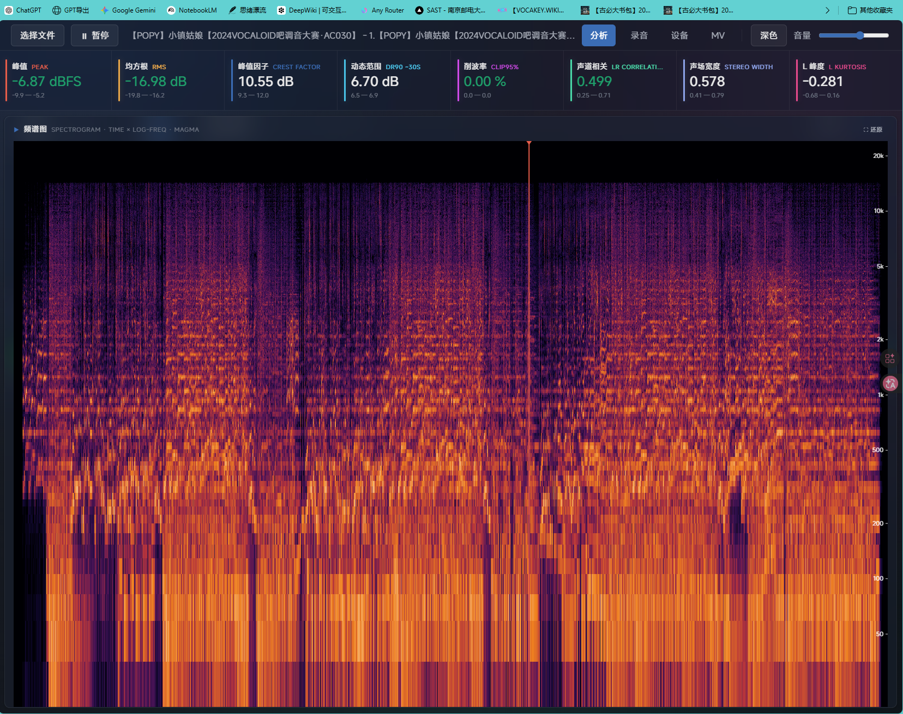
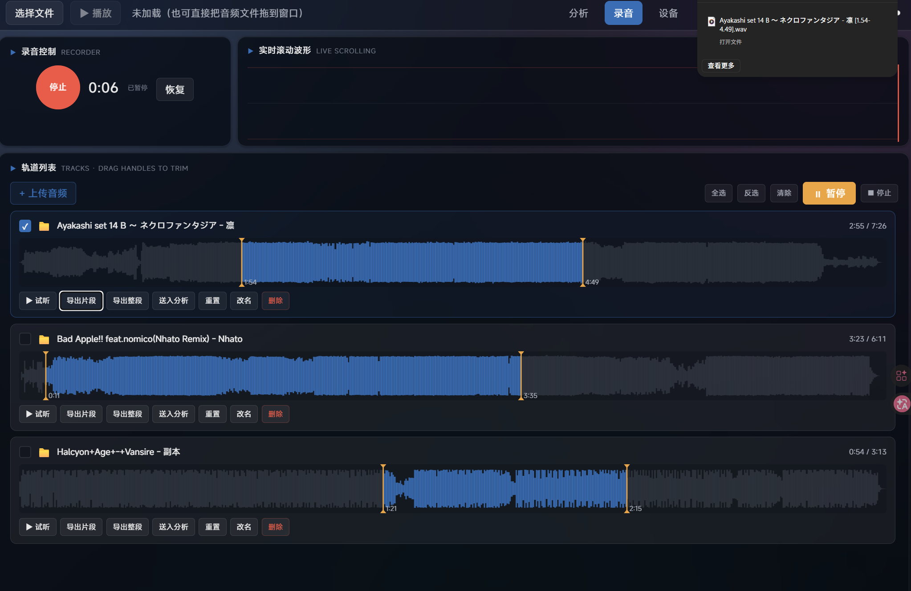
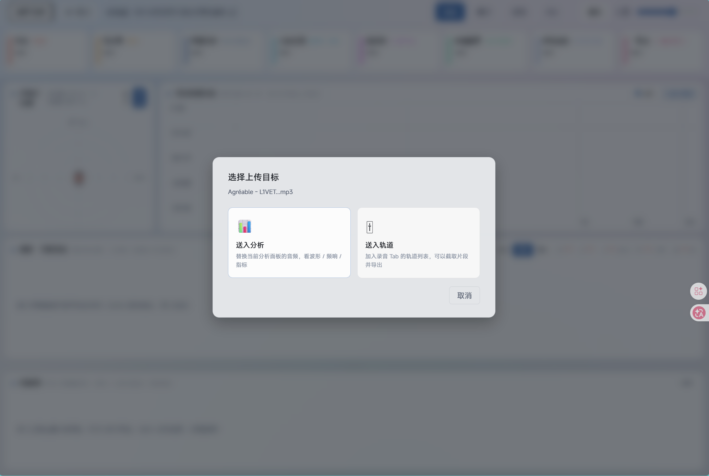

# LoudnessVis

[English](./README.md) | [简体中文](./README.zh-CN.md)

Open-source audio visualization toolkit for inspecting loudness-war traits in mastered music. LoudnessVis turns waveform clipping, dynamic-range collapse, frequency imbalance, stereo-field behavior, and LUFS-style loudness metrics into visual panels that are easier to reason about.

Repository: <https://github.com/S1ntinel/loudness-vis>
Thanks: [linux.do](https://linux.do/)

## Demo

[](./assets/demo/loudnessvis-demo.mp4)

Click the preview to open the full MP4 demo video.

## Screenshots

Analysis dashboard:



Recording and multi-track editor:



Upload target modal:



## Overview

LoudnessVis is built with React + TypeScript and focuses on visual analysis of mastering-side audio traits:

- whole-track waveform navigation with click / drag seeking
- RGB band coloring and spectral-centroid hue mapping for low / mid / high energy distribution
- real-time spectrum curves with multi-track frequency-response comparison
- full-track spectrogram heatmap using a Magma-style palette
- goniometer and 4-band sound-field sphere for stereo width, balance, and Mid / Side cues
- LUFS-oriented readouts: Momentary, Short-term, Integrated, True Peak, and Loudness Range
- peak, RMS, crest factor, DR-style range, clip ratio, and channel correlation metrics

The repository is now in the `1.0` stable release stage and is distributed under the MIT license.

## Visualization Algorithm Source

The visualization-panel algorithm implementation has been extracted into [`Visualization algorithm/`](./Visualization%20algorithm/) for easier review and reuse.

| Area | Files |
| --- | --- |
| FFT and DSP helpers | `src/audio/fft.ts`, `src/audio/dsp.ts` |
| Average spectrum | `src/audio/avgSpectrum.ts` |
| RGB waveform coloring | `src/audio/coloredPeaks.ts` |
| STFT spectrogram | `src/audio/spectrogram.ts` |
| Sound-field analysis | `src/audio/soundField.ts` |
| LUFS, True Peak, LRA | `src/audio/lufs.ts` |
| Canvas panels | `src/panels/` |
| Analyze-page composition | `src/tabs/Analyze/` |

This directory is a source snapshot of the current panel algorithms and rendering code, not a separate npm package.

## Features

### Analysis Panels

- seekable waveform overview
- real-time spectrum and multi-track comparison legend
- full-track spectrogram with crosshair and draggable playhead
- goniometer and sound-field sphere modes
- LUFS display and loudness-oriented statistics
- light / dark visual themes

### Recording and Track Editing

- browser microphone recording
- live scrolling recording waveform
- uploaded or recorded track list with mini waveforms
- trim handles, preview toggles, WAV export, and selected-track mix playback

### Devices and System Audio Control

- input / output device selection and live input-level monitoring
- app output routing with fallback to the system default output
- Windows volume mixer session controls for per-app mute / volume / activity state
- pre-recording prompts to avoid starting captures that would only produce visuals or silent audio

### MV Editing and Export

- templates, themes, spectrum styles, dynamic backgrounds, and particle effects
- asset library for audio / video / image / lyrics / font inputs
- project import / export with zip / inline / path modes
- export presets plus recording-time warnings when audio capture is not fully configured

## How to use the four main sections

### 1. Analyze

- Start by loading an audio file with **Select File**.
- Use the waveform for seeking, then inspect spectrum, spectrogram, sound field, and LUFS panels together.
- Use `Shift + mouse wheel` to zoom the waveform / spectrogram timeline and double-click to reset the view.
- This section is best for spotting clipping, loudness compression, spectral imbalance, and stereo issues.

### 2. Record

- Record from a microphone or add local audio files into the multi-track list.
- If you want to capture system playback audio, configure a loopback device first (for example Stereo Mix); the app now warns before starting if the current source is not properly configured.
- Each track supports trim, preview, rename, clip export, and selected-track mix playback.
- Use this section for quick capture, trimming, reference track comparison, and WAV export.

### 3. Devices

- Choose input / output devices and watch live input levels.
- Route the app output to a selected playback device or switch back to the default system output.
- On the Windows desktop build, inspect Windows audio sessions and apply per-session mute / volume changes.
- This section is the operational control center for routing, monitoring, and playback-device checks.

### 4. MV

- Import audio, video background, image layers, lyrics, and fonts, then combine them through templates and the effect rack.
- Tune spectrum style, dynamic backgrounds, particle variants, text overlays, and asset visibility.
- Save and restore project files for repeatable editing.
- Before exporting, confirm the audio source path; the app warns when an export may otherwise contain visuals only.

### Delivery Modes

| Mode | Purpose | Entry |
| --- | --- | --- |
| React Web | Main Vite + React application | `npm run dev` |
| Local demo server | Stable localhost launcher for testing | `npm run start:local` |
| Lite HTML route | Serve the retained single-file Lite HTML on localhost | `npm run start:lite` |
| Lite bundle | Shareable standalone HTML release | [`Releases`](https://github.com/S1ntinel/loudness-vis/releases) |
| UV launcher | Distributable local web launcher for demos | [`UV/README.md`](./UV/README.md) |
| Electron | Desktop/device integration path | `npm run dev:electron` / `npm run build:exe` |

## Tech Stack

| Layer | Choice |
| --- | --- |
| Frontend | React 18 + TypeScript |
| Build | Vite 5 |
| State | Zustand |
| Desktop shell | Electron 32 |
| Audio DSP | Hand-written TypeScript FFT / STFT / LUFS / spectrum analysis / WAV export |
| Local launcher | Python + uv |
| License | MIT |

The DSP implementation does not depend on third-party audio-analysis libraries. FFT, STFT, spectrum analysis, LUFS calculation, sound-field analysis, and WAV export are implemented in this repository.

## Quick Start

```powershell
git clone https://github.com/S1ntinel/loudness-vis.git
cd loudness-vis
npm install
npm run dev
```

Build the React app:

```powershell
npm run build
```

Start a stable local demo server:

```powershell
npm run start:local
```

Open the retained Lite HTML on localhost:

```powershell
npm run start:lite
```

Refresh the Lite bundle:

```powershell
npm run lite:build
```

Build the UV demo package:

```powershell
npm run uv:build
```

Run Electron in development:

```powershell
npm run dev:electron
```

Release assets are available from [GitHub Releases](https://github.com/S1ntinel/loudness-vis/releases).

## Repository Layout

| Path | Purpose |
| --- | --- |
| `src/` | React app, audio engine, DSP helpers, and visualization panels |
| `assets/demo/` | README demo assets: homepage GIF preview and linked MP4 clip |
| `assets/icons/` | Application and installer icons |
| `assets/screenshots/` | README product screenshots for the analysis, recording, and upload flows |
| `Visualization algorithm/` | Open-source snapshot of the visualization panel algorithms |
| `public/` | Static assets shared by web and packaging flows |
| `lite.html` | Retained single-file Lite HTML source |
| `legacy.html` | Compatibility alias for the retained Lite HTML |
| `UV/` | Python / uv launcher package for local demo delivery |
| `electron/` | Electron entry points for desktop builds |
| `scripts/` | Build, sync, and packaging scripts |
| `docs/` | Development log and release notes |

## Release Notes

- The retained single-file page is labeled as `lite.html` in Releases.
- `legacy.html` remains as a compatibility alias for the older Lite naming.
- Lite and UV distributables are published through GitHub Releases instead of being stored in generated folders on the main branch.
- Generated folders such as `node_modules/`, `dist/`, `lite/`, `UV/dist/`, archives, and local logs are intentionally excluded from version control.

## Roadmap

- [x] React app migration
- [x] Multi-band waveform coloring and LUFS metrics
- [x] Recording and multi-track editor
- [x] Spectrogram and sound-field sphere
- [x] Multi-track frequency-response comparison
- [x] Extract visualization algorithms into `Visualization algorithm/`
- [ ] System device volume control through Electron + Windows COM
- [ ] MV editor with Canvas and video export

## Related Links

- GitHub: <https://github.com/S1ntinel/loudness-vis>
- Releases: <https://github.com/S1ntinel/loudness-vis/releases>
- Author profile: <https://github.com/S1ntinel>
- Thanks: [linux.do](https://linux.do/)
- Embedded learning roadmap: <https://github.com/S1ntinel/embedded-learning-roadmap>

## Contributors

- Claude
- Codex

## License

MIT
