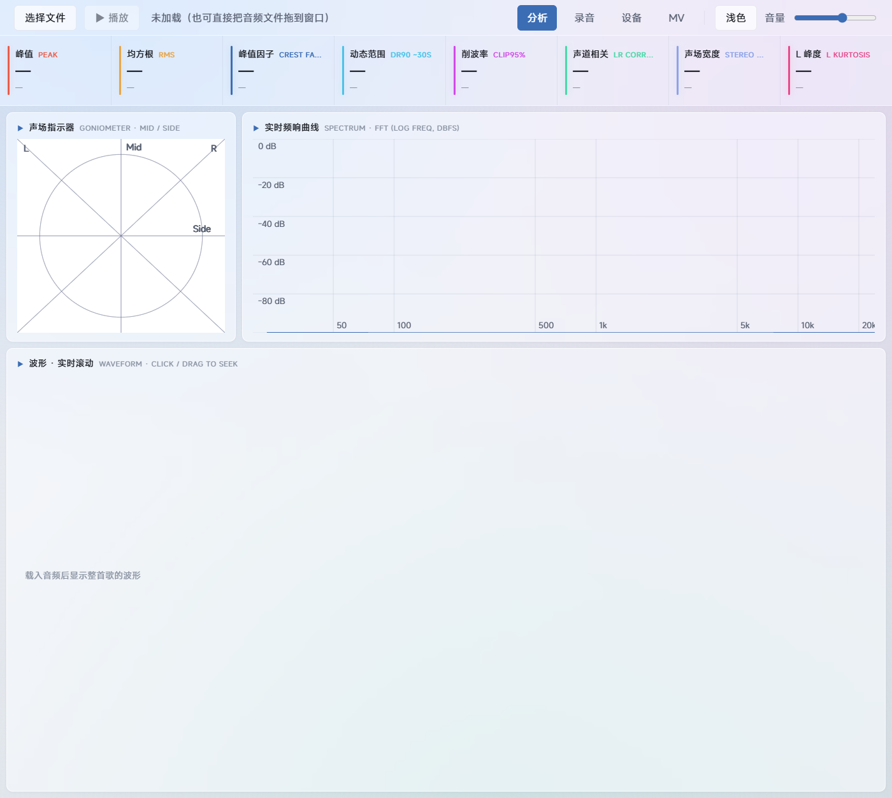
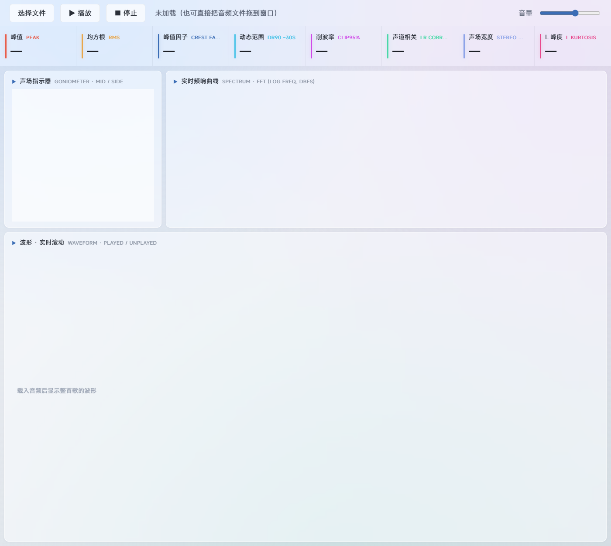
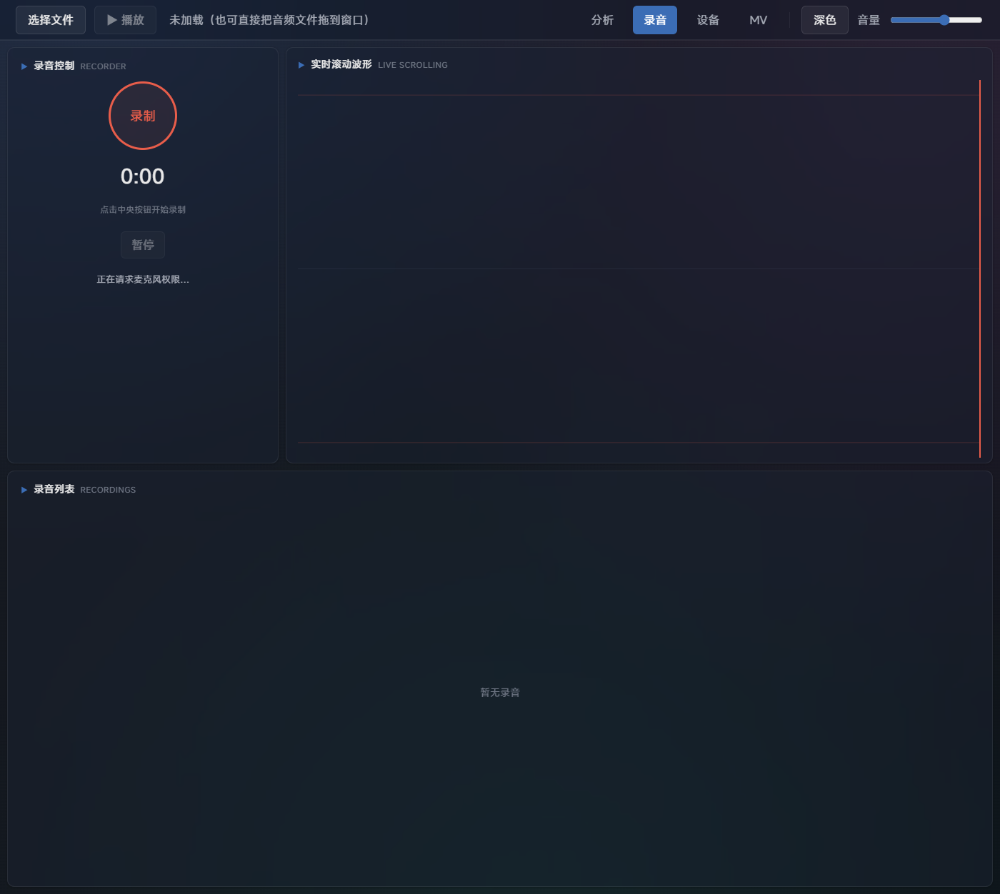
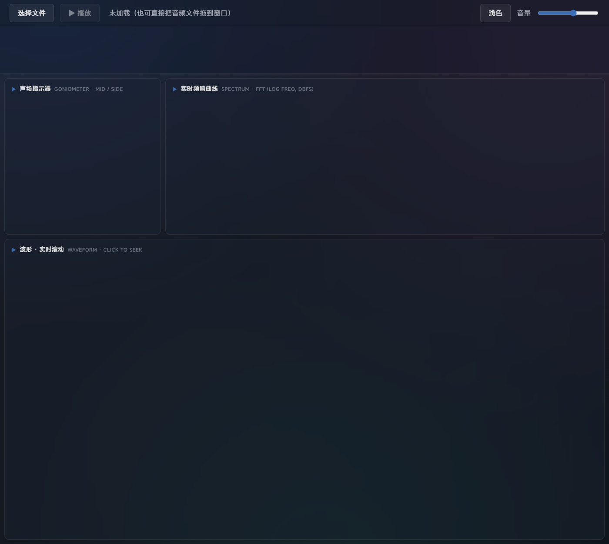

# LoudnessVis

[English](./README.md) | [简体中文](./README.zh-CN.md)

LoudnessVis 是一个面向响度战争分析的音频可视化工具，当前包含 React Web 主界面、Lite HTML 演示版、UV 本地启动包，并预留 Electron 桌面化路线。

## 项目概览

LoudnessVis 的目标，是把母带和响度相关特征用更直观的方式展示出来，便于试听和观察：

- 可拖拽定位的整曲波形概览
- 实时频谱显示
- 声场指示器与立体声宽度观察
- 面向响度分析的指标，包括峰值、RMS、峰值因子、动态范围、削波率与声道相关性
- 支持多种交付方式，分别服务于开发、演示、测试和后续桌面化

## 预览

| React 界面 | Legacy / Lite 演示版 |
| --- | --- |
|  |  |

| 录音 / 分析视图 | 深色主题 |
| --- | --- |
|  |  |

## 交付模式

| 模式 | 用途 | 入口 |
| --- | --- | --- |
| React Web | 基于 Vite + React 的主开发界面 | `npm run dev` |
| 本地演示服务 | 稳定的 localhost 启动方式，适合测试与演示 | `npm run start:local` |
| Legacy 服务路由 | 在 localhost 上打开保留的单文件 HTML Demo | `npm run start:legacy` |
| Lite 包 | 可直接分发的独立 HTML 版本 | [`lite/index.html`](./lite/index.html) |
| UV 启动包 | 适合本地演示分发的 Web 启动器 | [`UV/README.md`](./UV/README.md) |
| Electron | 未来桌面端 / 设备集成路线 | `npm run dev:electron` / `npm run build:exe` |

## 快速开始

### Web 开发

```powershell
npm install
npm run dev
```

### 构建 React 主应用

```powershell
npm run build
```

### 启动稳定的本地演示服务

```powershell
npm run start:local
```

### 刷新 Lite 分发目录

```powershell
npm run lite:build
```

### 构建 UV 演示包

```powershell
npm run uv:build
```

### 以开发模式运行 Electron

```powershell
npm run dev:electron
```

## 仓库结构

| 路径 | 说明 |
| --- | --- |
| `src/` | React 应用、音频引擎、DSP 工具和各类可视化面板 |
| `public/` | Web 与打包流程共用的静态资源 |
| `legacy.html` | 保留下来的单文件 HTML Demo |
| `lite/` | 适合独立分发的 HTML Lite 包 |
| `UV/` | 基于 Python / uv 的本地演示启动包 |
| `electron/` | 未来桌面版所需的 Electron 入口 |
| `scripts/` | 构建、同步和打包脚本 |

## 公开仓库说明

- 本仓库源码采用 [`LICENSE`](./LICENSE) 中的 MIT 协议发布。
- 仓库中包含的字体资源属于第三方资产，说明见 [`THIRD_PARTY_NOTICES.md`](./THIRD_PARTY_NOTICES.md)。
- `node_modules/`、`dist/`、`UV/dist/`、压缩包和本地日志等生成内容不会纳入版本控制。

## 路线图

- 继续稳定 React 分析流程
- 持续保留 Lite HTML 作为轻量演示 fallback
- 维护 UV 启动器，方便内部演示和测试分发
- 逐步扩展 Electron，对接未来设备侧工作流

## 相关文档

- Lite 包说明：[`lite/README.md`](./lite/README.md)
- UV 启动包说明：[`UV/README.md`](./UV/README.md)

## 许可证

MIT
